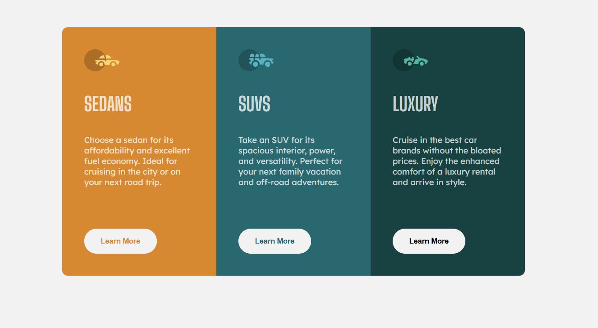

# Frontend Mentor - 3-column preview card component solution

This is a solution to the [3-column preview card component challenge on Frontend Mentor](https://www.frontendmentor.io/challenges/3column-preview-card-component-pH92eAR2-). Frontend Mentor challenges help you improve your coding skills by building realistic projects.

## Table of contents

- [Overview](#overview)
  - [The challenge](#the-challenge)
  - [Screenshot](#screenshot)
  - [Links](#links)
- [My process](#my-process)
  - [Built with](#built-with)
  - [What I learned](#what-i-learned)
  - [Continued development](#continued-development)
- [Author](#author)

**Note: Delete this note and update the table of contents based on what sections you keep.**

## Overview

### The challenge

Users should be able to:

- View the optimal layout depending on their device's screen size
- See hover states for interactive elements

### Screenshot



### Links

- Live Site URL: [Solution](https://beckycode.github.io/3-column-preview-card-component/)

## My process

### Built with

- Semantic HTML5 markup
- CSS custom properties
- Flexbox
- Mobile-first workflow

### What I learned

When I imported the fonts, I saw the suggestions to add fonts as classes similar to Tailwind, where you focus on utility classes:

```css
.lexend-deca {
  font-family: "Lexend Deca", serif;
  font-optical-sizing: auto;
  font-weight: 400;
  font-style: normal;
  font-size: 15px;
}
```

When I tried to add the footer I learnt a new way to do it, just setting the `min-height: 100vh` in the body and then in the footer add:
`margin-top:auto`

### Continued development

I did this project previously some years ago and I wanted to compare how I would do it this time, and definitely I've improved a lot.
I'll continue brushing up my skills in CSS.
At the time of this challenge I'm taking an advance CSS course on Udemy.

## Author

- Website - [Beckycode](https://www.beckycode.com/)
- Frontend Mentor - [@beckycode](https://www.frontendmentor.io/profile/beckycode)
- LinkedIn - [@yourusername](https://www.linkedin.com/in/rebecagonzalezerazo/)
